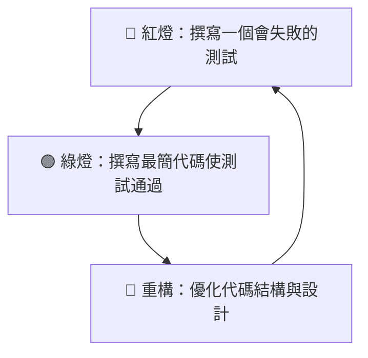

# 🔴🟢🔵 測試驅動開發技能 (`tdd`)

此技能強制 AI 助理在開發過程中遵循嚴格的「紅-綠-重構（Red-Green-Refactor）」循環。這能確保每一行程式碼都具備測試覆蓋率，且設計架構保持高度解耦與可維護性。

## 🧪 TDD 核心循環步驟

當啟用 `/tdd` 技能時，AI 助理**必須**以以下順序進行開發，絕不能跳過任何步驟：

### 🔴 步驟 1：撰寫一個會失敗的測試 (Red)
1. **分析行為**：明確你要實作的最小功能單元（例如：一個函式、一個 API 路由的特定響應）。
2. **撰寫測試**：在測試檔案中，新增一個針對該行為的測試案例。此時，被測試的目標程式碼或函式可能還不存在，或者只是一個空殼。
3. **執行測試**：運行測試套件，**確認該測試確實失敗（Red）**，且錯誤原因符合預期（如 `ImportError` 或 `AssertionError`）。

> [!WARNING]
> 如果測試在實作功能前就自動通過了，說明測試寫得不夠精準，或者該行為早已被實作。此時必須修正測試，直到它呈現失敗狀態。

### 🟢 步驟 2：實作最簡單的代碼以通過測試 (Green)
1. **快速實作**：撰寫「最快、最簡單」的程式碼，甚至是寫死（Hardcode）返回值，唯一目標是讓剛剛失敗的測試通過。
2. **運行測試**：執行測試套件，確認所有的測試（包括既有的測試與新寫的測試）**全部通過（Green）**。

> [!TIP]
> 此階段不需要追求完美的設計或高效能，首要目標是快速取得綠燈反饋，降低心理負擔。

### 🔵 步驟 3：在安全綠燈下進行重構 (Refactor)
1. **消除壞味道 (Code Smells)**：在確保測試覆蓋的前提下，優化剛寫好的程式碼。
   * 移除重複的代碼。
   * 將魔術字串/數字提取為常量。
   * 重命名變數或函式以符合 Ubiquitous Language。
   * 將過長的函式拆解為單一職責的輔助函式。
2. **驗證重構**：每做一步小調整，就**重新運行測試**，確保代碼始終保持在「綠燈」狀態。

---

## ⚠️ 執行約束

* **嚴格順序**：禁止先寫功能程式碼再補寫測試。
* **小步快跑**：每次循環只專注於一個極小的功能行為，不要試圖一次寫完所有測試。
* **自動化執行**：在每個步驟中，主動調用測試工具（如 `pytest`、`jest`、`vitest` 等）並將輸出結果呈現給開發者。
